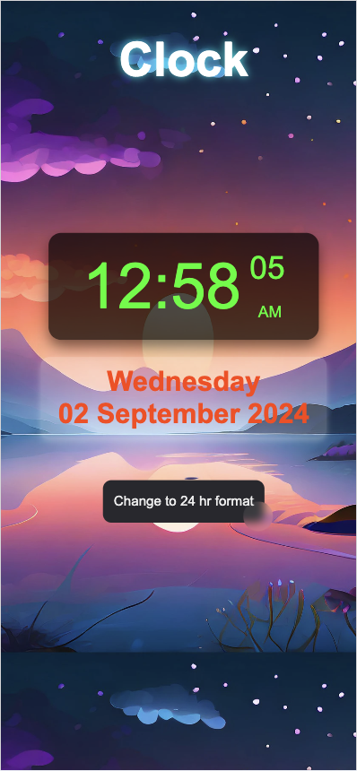

# 12/24-Hour Clock with Interactive Button

This project is a **12/24-Hour Digital Clock** built using HTML, CSS, and JavaScript. It displays the current time (hours, minutes, seconds) along with AM/PM for the 12-hour format. The clock features an interactive button that allows the user to toggle between 12-hour and 24-hour formats with smooth transitions and hover effects.

## Table of Contents
- [Features](#features)
- [Technologies Used](#technologies-used)
- [Setup](#setup)
- [Screenshots](#screenshots)

## Features
- Displays the current time in **12-hour** format by default, with AM/PM indicators.
- Provides a button to switch between **12-hour** and **24-hour** time formats.
- Displays the **current day, date, month, and year**.
- Includes an interactive button with hover, focus, and active effects.
- The clock updates every second and is fully responsive for both desktop and mobile devices.

## Technologies Used
- **HTML5**: Structure of the webpage.
- **CSS3**: Styling, including Flexbox, button animations, hover effects, and responsiveness.
- **JavaScript**: Handles real-time updates for the clock and format switching.

## Setup

To get started with the project locally, follow these steps:

1. **Clone the repository**:
    ```bash
    git clone https://github.com/your-username/12-24-hour-clock.git
    ```

2. **Navigate into the project directory**:
    ```bash
    cd 12-24-hour-clock
    ```

3. **Open the `index.html` file** in your web browser:
    - You can double-click on the `index.html` file or open it in your preferred browser.

## Screenshots

### Desktop View:


### Mobile View:


## Thank You

Thank you for checking out my **12/24-Hour Digital Clock** project! I hope you found it useful and interesting. If you have any feedback, suggestions, or improvements, feel free to contribute or reach out. Your input is greatly appreciated!

Happy coding! 😊

